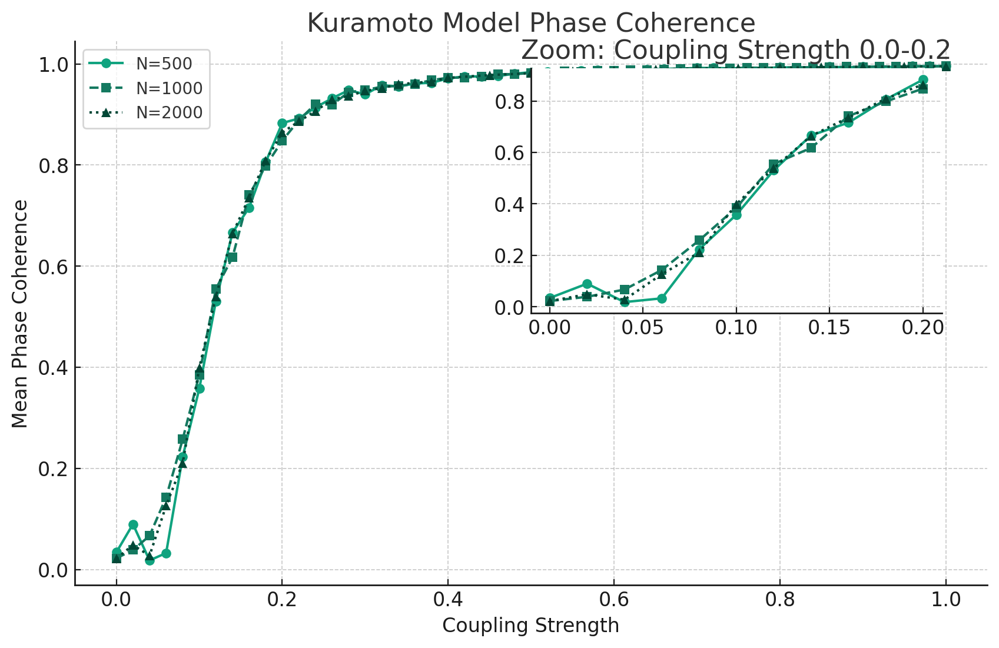
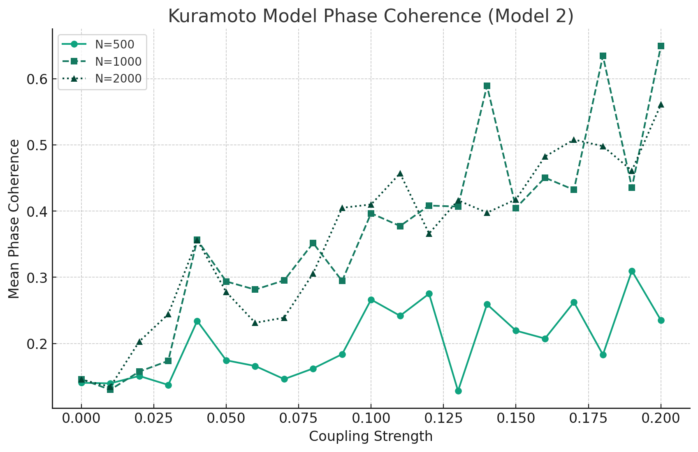

# Synchronization-Criticality-Detection-BA-Networks

Code for replicating models from 2 papers, utilizing Kuramoto library for integration. Investigate critical coupling strengths in BA networks of varying sizes, comparing with theoretical values to discuss existence of criticality vs finite size effects.

Model1: [2004epl]Synchronization of Kuramoto Oscillators in Scale-Free Net- works

Model2: [2004pre]Frequency synchronization in a random oscillator network

## 问题重述

1. 阅读本周参考资料（2篇）。

2. 参考kuramoto库的实现代码（利用积分实现），对1中的2篇论文的模型进行复现，观察对于不同规模的BA网络来讲，是否存在临界的耦合强度，并与理论的临界值进行比较，以进一步讨论临界值是否存在，还是因为有限尺度效应（finite size effect）。需要注意序参量的定义。

## 思路分析

### Model 1 (参照 [2004epl]Synchronization of Kuramoto Oscillators in Scale-Free Networks)

- 网络构建：使用BA model构建具有尺度自由特性的网络，网络规模分别为N=500, 1000, 2000。m = 3. gamma控制在3左右。
- 初始化：为每个节点随机分配自然频率(ω)和初始相位(θ)，自然频率从均匀分布中抽取。
- coupling变化：逐步增加coupling(λ)，使用数值积分方法求解Kuramoto模型。
- r_mean计算：通过Kuramoto模型的r_mean来量化系统的同步程度，观察序参量随coupling的变化，以确定同步的临界点。
- 数据分析：分析不同coupling下r_mean的变化，确定系统达到同步的临界耦合强度，并与理论值进行比较。

### Model 2 (参照 [2004pre]Frequency synchronization in a random oscillator network)

- 网络和初始化：同Model 1，构建BA网络，随机初始化每个节点的自然频率和初始相位。
- coupling调整：从低coupling开始，逐渐增加，同时记录系统的动态变化。
- r_mean测量：计算不同coupling下的r_mean，分析系统是否达到频率同步，及其发生的条件。
- 连续极限方程分析：结合理论分析，从连续极限方程中提取出同步的充分条件，验证数值模拟的结果。
- 结果对比与讨论：对比两种模型在不同网络规模下的临界耦合强度，讨论有限尺度效应的可能影响。

### 代码结构

generate_network(): 生成BA网络。
kuramoto_simulation(): 执行Kuramoto模型模拟。
calculate_order_parameter(): 计算r_mean。
main_simulation(): 控制整个模拟流程，包括网络规模的设定和coupling的调整。

## 代码实现

### Model 1


```python
import numpy as np
import networkx as nx
import csv
import random
import powerlaw as pl
from Modify_KuramotoModel1 import Kuramoto
from multiprocessing import Pool, cpu_count

random.seed(3407)

def create_barabasi_albert_network(size, connections):
    """Generates a Barabasi-Albert graph."""
    return nx.barabasi_albert_graph(size, connections)

def calculate_power_law_exponent(degrees):
    """Calculates the power law exponent using the powerlaw library."""
    fit = pl.Fit(degrees, discrete=True)
    return round(fit.power_law.alpha, 2)  # Typical value approximates to 3

def simulate_kuramoto_model(network_size, connections):
    """Runs the Kuramoto model simulation and writes results to a file."""
    header = ['coupling', 'r_mean']
    filename = f'OutcomeData/model1_output_{network_size}.txt'

    with open(filename, 'w', newline='') as file:
        file.write(' '.join(header))

    network = create_barabasi_albert_network(network_size, connections)
    degree_sequence = [network.degree(node) for node in network]
    gamma = calculate_power_law_exponent(degree_sequence)
    adjacency_matrix = nx.to_numpy_array(network)
    natural_frequencies = np.random.uniform(-0.5, 0.5, network_size)
    coupling_values = np.linspace(0, 1, 50)
    initial_phases = np.random.uniform(-np.pi, np.pi, network_size)
    simulation_results = []

    for coupling_strength in coupling_values:
        model = Kuramoto(coupling=coupling_strength, dt=0.1, T=100, n_nodes=network_size, natfreqs=natural_frequencies)
        activity_matrix = model.run(adj_mat=adjacency_matrix, angles_vec=initial_phases)
        simulation_results.append(activity_matrix)

        results_array = np.array(simulation_results)

    for index, coupling_strength in enumerate(coupling_values):
        coherence_mean = np.mean([model.phase_coherence(phase_vec) for phase_vec in results_array[index, :, -1000:].T])

        # Write results to file
        with open(filename, 'a') as file:
            file.write(f"{coupling_strength} {coherence_mean}\n")

if __name__ == '__main__':
    network_configs = [(500, 3), (1000, 3), (2000, 3)]
    with Pool(processes=cpu_count()) as pool:
        pool.map(simulate_kuramoto_model, network_configs)

```

### Model 2

```python
import numpy as np
import networkx as nx
import os
import csv
import random
from Modify_KuramotoModel2 import Kuramoto

random.seed(3407)

def generate_network(network_size, connections):
    """Generates a Barabasi-Albert network and its adjacency matrix."""
    network = nx.barabasi_albert_graph(network_size, connections)
    return nx.to_numpy_array(network)

def write_results_to_file(network_size, simulation_results, coupling_values, model):
    """Writes the results of simulations to a text file."""
    filename = f'OutcomeData/model2_output_{network_size}.txt'
    with open(filename, 'a') as file:
        for i, coupling in enumerate(coupling_values):
            r_mean = np.mean([model.phase_coherence(vec) for vec in np.array(simulation_results)[i, :, -1000:].T])
            file.write(f"{coupling} {r_mean}\n")


def run_kuramoto_simulation(network_size, connections):
    """Executes the Kuramoto model for a range of coupling values and computes coherence."""
    adjacency_matrix = generate_network(network_size, connections)
    natural_frequencies = np.random.normal(0, 1, network_size)
    coupling_values = np.arange(0, 0.201, 0.02)
    initial_phases = np.random.uniform(-np.pi, np.pi, network_size)
    simulation_results = []
    models = []  # Keep track of models for phase coherence calculation

    for coupling_strength in coupling_values:
        print(coupling_strength)
        model = Kuramoto(coupling=coupling_strength, dt=0.1, T=100, n_nodes=network_size, natfreqs=natural_frequencies)
        activity_matrix = model.run(adj_mat=adjacency_matrix, angles_vec=initial_phases)
        simulation_results.append(activity_matrix)
        models.append(model)  # Store model used for each simulation

    return simulation_results, coupling_values, models[-1]  # Return the last model used

def run_simulation():
    for params in [(500, 2), (1000, 2), (2000, 4)]:
        network_size, connections = params
        print(network_size)
        simulation_results, coupling_values, model = run_kuramoto_simulation(network_size, connections)
        write_results_to_file(network_size, simulation_results, coupling_values, model)

if __name__ == '__main__':
    run_simulation()

```

## 结果与讨论

Model 1的最终结果如下：



Model 2的最终结果如下：



基于结果发现：Model 1的结果表明存在一个明显的临界耦合强度，超过这个值时系统的同步显著增强。相比之下，Model 2的理论分析表明，在特定条件下，随机尺度自由网络的同步临界耦合强度可能接近零，表明在这些网络中同步更容易发生，不需要很强的耦合。

然而，model 1存在m固定的问题，根据具体的参数和相应结果，我更倾向于第2篇研究是正确的，第一篇的研究并没有讨论不同的参数，在随机尺度自由网络中研究频率同步，发现当网络符合特定条件（如度分布的幂律指数在2至3之间）时，理论上同步的临界耦合强度接近于零。模拟数据显示，即使在低耦合强度下，系统也能达到一定程度的同步，支持理论分析的结论。

在Model 1和Model 2的模拟中都观察到了有限尺度效应的影响。随着网络规模的增大，同步行为的展现更为明显，这可能是因为大规模网络提供了更多的路径和连接，促进了同步的发生。这表明实验观测到的临界点部分受到网络规模的影响。